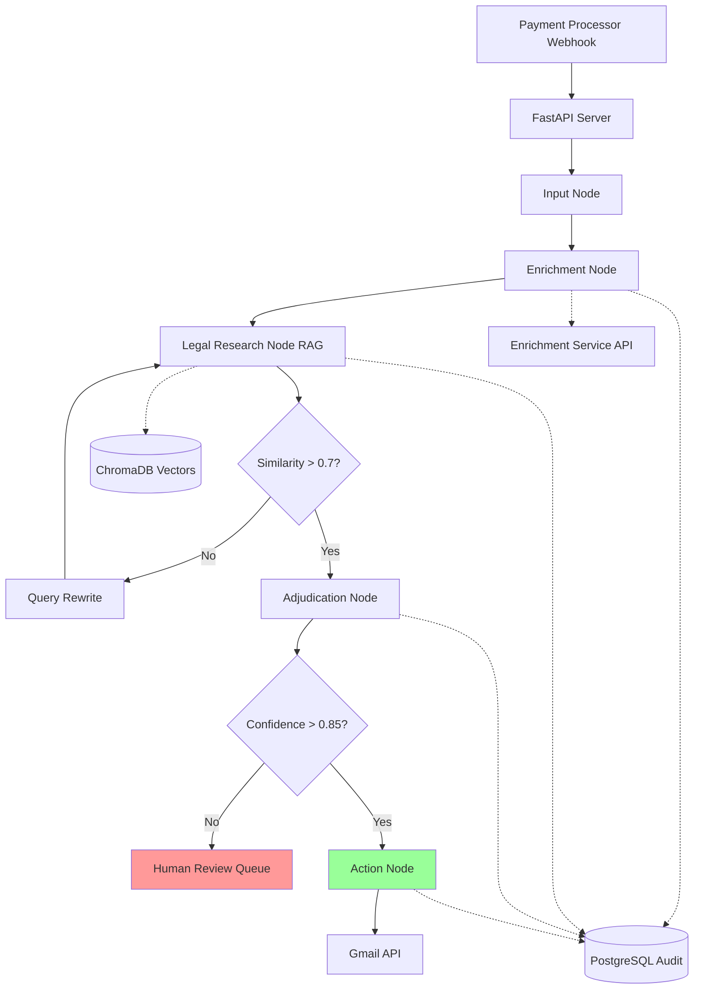
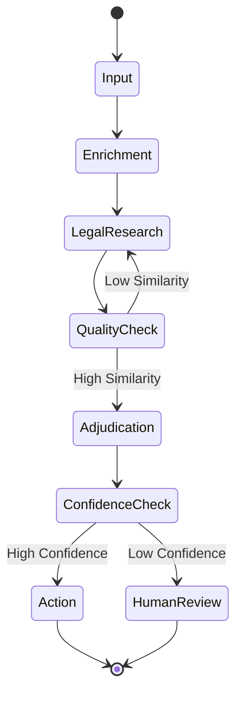

# Design Document

## Overview

The Visa Dispute Resolution Agent is an event-driven autonomous system built on a microservices architecture using FastAPI, LangGraph, and LangChain. The system processes payment disputes through a state graph workflow that includes webhook ingestion, transaction enrichment, self-reflective RAG-based legal research, confidence-scored adjudication, and automated actions with human-in-the-loop escalation.

The architecture emphasizes production-grade reliability through structured output validation (Pydantic), comprehensive audit logging (PostgreSQL), vector-based legal research (ChromaDB), and intelligent routing based on confidence thresholds. The LangGraph state machine manages complex workflows including retry logic, conditional branching, and self-correction loops.

## Architecture

### High-Level Architecture



### Technology Stack

- **API Framework**: FastAPI (Python 3.11+) - Async REST API with automatic OpenAPI documentation
- **Orchestration**: LangGraph - State machine for managing agent workflow, loops, and conditional routing
- **LLM Framework**: LangChain - Tool binding, prompt management, and LLM integration
- **Validation**: Pydantic v2 - Schema validation for structured outputs and API contracts
- **Vector Store**: ChromaDB - Embedding storage and similarity search for Visa rules
- **Relational DB**: PostgreSQL - Audit trails and human review queue
- **Async DB Driver**: AsyncPG - Non-blocking PostgreSQL operations
- **Email Integration**: Gmail API - Automated email dispatch

### Deployment Architecture

The system follows a microservices pattern with clear separation of concerns:

```
/app
  /agents      - LangGraph state machine definitions
  /tools       - RAG retriever and transaction lookup tools
  /schema      - Pydantic models for validation
  /db          - Database connection and query logic
  /api         - FastAPI route handlers
  /config      - Configuration management
```

## Components and Interfaces

### 1. FastAPI Server (`/app/api/main.py`)

**Responsibilities:**
- Expose REST endpoints for webhook ingestion
- Handle HTTP request/response lifecycle
- Initialize database connections and LangGraph
- Provide health check and monitoring endpoints

**Key Endpoints:**
- `POST /webhooks/dispute` - Receive dispute notifications
- `GET /disputes/{dispute_id}` - Query dispute status
- `GET /health` - System health check
- `GET /review-queue` - List cases pending human review

**Interface:**
```python
@app.post("/webhooks/dispute")
async def receive_dispute(payload: DisputeWebhook) -> DisputeResponse:
    """Receives dispute webhook and initiates processing"""
    pass
```

### 2. State Graph (`/app/agents/dispute_graph.py`)

**Responsibilities:**
- Define the workflow state machine using LangGraph
- Manage state transitions between nodes
- Implement conditional edges for routing logic
- Handle retry logic with exponential backoff

**State Definition:**
```python
class DisputeState(TypedDict):
    dispute_id: str
    payload: Dict[str, Any]
    transaction_history: Optional[List[Transaction]]
    retrieved_rules: Optional[List[Document]]
    similarity_scores: Optional[List[float]]
    query_attempts: int
    decision: Optional[DisputeDecision]
    confidence_score: Optional[float]
    actions_taken: List[str]
    error: Optional[str]
```

**Graph Structure:**
- Nodes: input_node, enrichment_node, legal_research_node, adjudication_node, action_node, human_review_node
- Conditional Edges: similarity_check, confidence_check
- Retry Logic: Exponential backoff with max 3 attempts per node

### 3. RAG Retriever Tool (`/app/tools/rag_retriever.py`)

**Responsibilities:**
- Query ChromaDB for relevant Visa rules
- Calculate similarity scores for retrieved documents
- Implement self-reflective query rewriting
- Return structured retrieval results

**Interface:**
```python
class RAGRetriever:
    async def retrieve(
        self, 
        query: str, 
        top_k: int = 5
    ) -> RetrievalResult:
        """Retrieve relevant documents with similarity scores"""
        pass
    
    async def rewrite_query(
        self, 
        original_query: str, 
        attempt: int
    ) -> str:
        """Generate alternative query formulation"""
        pass
```

**Self-Correction Logic:**
- Attempt 1: Use original dispute description
- Attempt 2: Extract key entities and use synonyms
- Attempt 3: Use broader category-based query
- If all attempts fail: Route to human review

### 4. Transaction Enrichment Tool (`/app/tools/transaction_lookup.py`)

**Responsibilities:**
- Call internal enrichment API
- Fetch 3-year transaction history
- Analyze for friendly fraud patterns
- Handle API failures with retry logic

**Interface:**
```python
class TransactionEnrichment:
    async def fetch_history(
        self, 
        customer_id: str, 
        years: int = 3
    ) -> List[Transaction]:
        """Fetch customer transaction history"""
        pass
    
    def detect_fraud_patterns(
        self, 
        transactions: List[Transaction]
    ) -> FraudAnalysis:
        """Analyze transactions for friendly fraud indicators"""
        pass
```

### 5. Pydantic Schemas (`/app/schema/`)

**DisputeWebhook:**
```python
class DisputeWebhook(BaseModel):
    dispute_id: str
    customer_id: str
    transaction_id: str
    amount: Decimal
    currency: str
    reason_code: str
    description: str
    timestamp: datetime
```

**DisputeDecision:**
```python
class DisputeDecision(BaseModel):
    dispute_id: str
    decision: Literal["accept", "reject", "escalate"]
    confidence_score: float
    reasoning: str
    supporting_rules: List[str]
    recommended_action: str
```

**TransactionData:**
```python
class TransactionData(BaseModel):
    transaction_id: str
    customer_id: str
    amount: Decimal
    timestamp: datetime
    merchant: str
    status: str
```

### 6. Database Layer (`/app/db/`)

**PostgreSQL Schema:**
- `audit_log` - Complete agent reasoning trail
- `human_review_queue` - Low-confidence cases
- `dispute_history` - All processed disputes

**ChromaDB Collections:**
- `visa_rules` - Embedded Visa regulations and policies

**Interface:**
```python
class AuditLogger:
    async def log_node_entry(
        self, 
        dispute_id: str, 
        node_name: str, 
        state: Dict
    ) -> None:
        """Log state graph node entry"""
        pass
    
    async def log_decision(
        self, 
        dispute_id: str, 
        decision: DisputeDecision
    ) -> None:
        """Log adjudication decision"""
        pass
```

## Data Models

### Core Domain Models

**Dispute:**
- Represents a payment dispute from initiation through resolution
- Contains customer info, transaction details, and processing state
- Tracks confidence scores and routing decisions

**Transaction:**
- Historical transaction record for fraud analysis
- Includes amount, merchant, timestamp, and status
- Used to identify friendly fraud patterns

**Document:**
- Retrieved Visa rule or regulation
- Contains text content, metadata, and similarity score
- Used in adjudication reasoning

**FraudAnalysis:**
- Results of transaction history analysis
- Flags suspicious patterns (high chargeback rate, timing patterns)
- Influences adjudication confidence

### State Transitions



## Correctness Properties

*A property is a characteristic or behavior that should hold true across all valid executions of a system-essentially, a formal statement about what the system should do. Properties serve as the bridge between human-readable specifications and machine-verifiable correctness guarantees.*


### Property 1: Webhook payload validation
*For any* incoming webhook payload, if it conforms to the DisputeWebhook schema, it should be successfully parsed and processed; if it does not conform, it should return an HTTP 400 error with validation details.
**Validates: Requirements 1.2, 1.3**

### Property 2: State initialization completeness
*For any* valid dispute webhook, processing should create an initial state entry in the State Graph containing all required fields from the payload.
**Validates: Requirements 1.4**

### Property 3: Audit trail completeness
*For any* dispute that enters the system, every node transition, decision, and action should be logged to PostgreSQL with timestamp, node name, and relevant state data.
**Validates: Requirements 1.5, 7.1, 7.2, 7.3, 7.4**

### Property 4: Enrichment service invocation
*For any* dispute entering the enrichment node, the system should call the Enrichment Service with the customer identifier and request exactly 3 years of transaction history.
**Validates: Requirements 2.1, 2.2**

### Property 5: Enrichment state update
*For any* dispute where enrichment completes successfully, the dispute state should contain the retrieved transaction history and fraud analysis results.
**Validates: Requirements 2.3, 2.5**

### Property 6: Retry with exponential backoff
*For any* node that encounters a retriable failure (timeout, API error), the system should retry up to 3 times with exponentially increasing delays (e.g., 1s, 2s, 4s) before escalating.
**Validates: Requirements 2.4, 5.4, 6.2**

### Property 7: RAG query generation
*For any* dispute entering the legal research node, the system should generate a search query that includes key dispute details (reason code, description, amount).
**Validates: Requirements 3.1**

### Property 8: Similarity score calculation
*For any* RAG retrieval operation, every retrieved document should have an associated similarity score between 0.0 and 1.0.
**Validates: Requirements 3.2, 10.1**

### Property 9: Self-reflective query rewriting
*For any* RAG retrieval where all documents have similarity scores below 0.7, the system should generate a different query formulation and retry retrieval, up to 3 total attempts.
**Validates: Requirements 3.3, 3.4, 10.2, 10.3, 10.4**

### Property 10: High-quality retrieval progression
*For any* RAG retrieval where at least one document has a similarity score of 0.7 or higher, the system should proceed to the adjudication node with those documents.
**Validates: Requirements 3.5**

### Property 11: Adjudication decision structure
*For any* dispute reaching the adjudication node, the system should generate a DisputeDecision that includes decision type, confidence score (0.0-1.0), reasoning, and supporting rule references.
**Validates: Requirements 4.2, 4.3, 8.4**

### Property 12: Confidence-based routing
*For any* adjudication decision, if the confidence score is below 0.85, the dispute should be routed to the Human Review Queue; if 0.85 or higher, it should proceed to the action node.
**Validates: Requirements 4.4, 5.1**

### Property 13: Human review queue persistence
*For any* dispute routed to the Human Review Queue, a record should be written to PostgreSQL with status "pending_review" and all case details.
**Validates: Requirements 4.5**

### Property 14: Email action execution
*For any* dispute reaching the action node, the system should draft an email containing the decision details and call the Gmail API to send it to the customer.
**Validates: Requirements 5.2, 5.3**

### Property 15: Action logging with metadata
*For any* successfully sent email, the audit trail should contain a log entry with email metadata (recipient, subject, timestamp, message ID).
**Validates: Requirements 5.5**

### Property 16: Conditional routing correctness
*For any* conditional decision point in the State Graph (similarity check, confidence check, retry exhaustion), the system should route to the next node that matches the state conditions.
**Validates: Requirements 6.3, 6.4**

### Property 17: Failure escalation
*For any* node that fails after exhausting maximum retry attempts, or any validation that fails after 3 generation attempts, the dispute should be routed to the Human Review Queue.
**Validates: Requirements 6.5, 8.3, 10.5**

### Property 18: Schema validation enforcement
*For any* output generated by the system (decisions, transaction data, API responses), the output should be validated against its corresponding Pydantic schema before being used or returned.
**Validates: Requirements 8.1, 8.5**

### Property 19: Validation retry with correction
*For any* output that fails schema validation, the system should retry generation up to 3 times with corrective prompts before escalating to human review.
**Validates: Requirements 8.2**

### Property 20: Transaction data schema conformance
*For any* transaction history retrieved from the Enrichment Service, all transaction records should conform to the TransactionData schema.
**Validates: Requirements 8.5**

## Error Handling

### Error Categories

**1. Validation Errors**
- Invalid webhook payloads → Return HTTP 400 with detailed validation errors
- Schema validation failures → Retry with corrective prompts (max 3), then escalate
- Malformed API responses → Log error, retry with backoff, then escalate

**2. External Service Errors**
- Enrichment Service timeout → Retry with exponential backoff (1s, 2s, 4s)
- Gmail API failure → Retry up to 3 times, then route to human review
- ChromaDB connection error → Log error, attempt reconnection, fail gracefully

**3. RAG Quality Errors**
- Low similarity scores (<0.7) → Trigger query rewriting loop (max 3 attempts)
- No documents retrieved → Generate broader query, escalate if persistent
- Embedding service failure → Log error, route to human review

**4. State Graph Errors**
- Node execution timeout → Log state, retry with backoff
- Invalid state transition → Log error, route to human review
- Unhandled exception → Capture full stack trace, persist state, escalate

### Error Recovery Strategies

**Retry with Exponential Backoff:**
```python
async def retry_with_backoff(
    func: Callable,
    max_attempts: int = 3,
    base_delay: float = 1.0
) -> Any:
    for attempt in range(max_attempts):
        try:
            return await func()
        except RetriableError as e:
            if attempt == max_attempts - 1:
                raise
            delay = base_delay * (2 ** attempt)
            await asyncio.sleep(delay)
```

**Circuit Breaker Pattern:**
- Track failure rates for external services
- Open circuit after 5 consecutive failures
- Half-open after 60 seconds to test recovery
- Close circuit after 3 consecutive successes

**Graceful Degradation:**
- If enrichment fails, proceed with limited data
- If RAG quality is low, include disclaimer in decision
- If email fails, queue for manual sending

### Audit Trail for Errors

All errors must be logged with:
- Error type and message
- Full stack trace
- Dispute ID and current state
- Timestamp and node name
- Retry attempt number
- Recovery action taken

## Testing Strategy

### Unit Testing

**Framework:** pytest with pytest-asyncio for async support

**Coverage Areas:**
- Pydantic schema validation (valid/invalid inputs)
- Query rewriting logic (different formulation strategies)
- Fraud pattern detection algorithms
- Similarity score calculations
- Routing logic (confidence thresholds, similarity thresholds)
- Error handling and retry logic

**Key Test Patterns:**
- Mock external services (Enrichment API, Gmail API)
- Use in-memory ChromaDB for RAG tests
- Test database operations with pytest-postgresql
- Verify audit log entries for all operations

**Example Unit Tests:**
```python
async def test_low_confidence_routes_to_human_review():
    """Verify decisions with confidence < 0.85 go to human review"""
    decision = DisputeDecision(
        dispute_id="test-123",
        decision="escalate",
        confidence_score=0.75,
        reasoning="Insufficient evidence",
        supporting_rules=[],
        recommended_action="human_review"
    )
    next_node = determine_next_node(decision)
    assert next_node == "human_review_node"

async def test_query_rewrite_generates_different_query():
    """Verify rewritten queries differ from originals"""
    original = "dispute chargeback reason code 10.4"
    rewritten = await rewrite_query(original, attempt=1)
    assert rewritten != original
    assert len(rewritten) > 0
```

### Property-Based Testing

**Framework:** Hypothesis (Python property-based testing library)

**Configuration:**
- Minimum 100 iterations per property test
- Deadline: 5000ms per test case
- Stateful testing for State Graph workflows

**Property Test Requirements:**
- Each property test MUST be tagged with a comment referencing the design document property
- Tag format: `# Feature: visa-dispute-agent, Property {number}: {property_text}`
- Each correctness property MUST be implemented by a SINGLE property-based test
- Tests should use Hypothesis strategies to generate diverse inputs

**Example Property Tests:**

```python
from hypothesis import given, strategies as st

# Feature: visa-dispute-agent, Property 1: Webhook payload validation
@given(st.builds(DisputeWebhook))
async def test_valid_webhooks_are_processed(webhook: DisputeWebhook):
    """For any valid webhook, processing should succeed"""
    response = await receive_dispute(webhook)
    assert response.status == "accepted"
    assert response.dispute_id == webhook.dispute_id

# Feature: visa-dispute-agent, Property 9: Self-reflective query rewriting
@given(
    st.lists(st.floats(min_value=0.0, max_value=0.69), min_size=1, max_size=10)
)
async def test_low_similarity_triggers_rewrite(similarity_scores: List[float]):
    """For any retrieval with all scores < 0.7, query should be rewritten"""
    retrieval_result = RetrievalResult(
        documents=[...],
        similarity_scores=similarity_scores
    )
    should_rewrite = evaluate_retrieval_quality(retrieval_result)
    assert should_rewrite is True

# Feature: visa-dispute-agent, Property 12: Confidence-based routing
@given(st.floats(min_value=0.0, max_value=1.0))
async def test_confidence_routing(confidence_score: float):
    """For any confidence score, routing should match threshold logic"""
    decision = DisputeDecision(
        dispute_id="test",
        decision="accept",
        confidence_score=confidence_score,
        reasoning="test",
        supporting_rules=[],
        recommended_action="test"
    )
    next_node = determine_next_node(decision)
    if confidence_score < 0.85:
        assert next_node == "human_review_node"
    else:
        assert next_node == "action_node"
```

**Hypothesis Strategies:**
- `dispute_webhooks()` - Generate valid DisputeWebhook instances
- `transaction_histories()` - Generate 3-year transaction lists
- `similarity_scores()` - Generate lists of floats between 0.0-1.0
- `confidence_scores()` - Generate floats between 0.0-1.0
- `visa_rules()` - Generate mock Visa rule documents

### Integration Testing

**Scope:**
- End-to-end workflow from webhook to action/escalation
- Database persistence (PostgreSQL and ChromaDB)
- External API integration (mocked with realistic responses)
- State Graph execution with all nodes

**Test Scenarios:**
1. Happy path: High-quality RAG → High confidence → Email sent
2. Self-correction: Low similarity → Query rewrite → Success
3. Human escalation: Low confidence → Human review queue
4. Retry logic: API timeout → Exponential backoff → Success
5. Failure escalation: Max retries exhausted → Human review

**Tools:**
- Docker Compose for test databases
- pytest fixtures for test data
- Testcontainers for isolated integration tests

### Performance Testing

**Metrics to Track:**
- End-to-end latency (target: <5 seconds for 95th percentile)
- RAG retrieval time (target: <500ms)
- Database query performance (target: <100ms)
- Concurrent request handling (target: 100 requests/second)

**Load Testing:**
- Use Locust or k6 for load generation
- Simulate realistic webhook traffic patterns
- Monitor resource usage (CPU, memory, database connections)

## Deployment Considerations

### Environment Configuration

**Required Environment Variables:**
- `DATABASE_URL` - PostgreSQL connection string
- `CHROMADB_HOST` - ChromaDB server address
- `ENRICHMENT_API_URL` - Internal enrichment service endpoint
- `GMAIL_API_CREDENTIALS` - Gmail API OAuth credentials
- `LLM_API_KEY` - OpenAI/Anthropic API key
- `LOG_LEVEL` - Logging verbosity (INFO, DEBUG, ERROR)

### Database Migrations

Use Alembic for PostgreSQL schema migrations:
- Version control all schema changes
- Support rollback for failed deployments
- Seed ChromaDB with Visa rules during initialization

### Monitoring and Observability

**Metrics:**
- Request rate and latency (per endpoint)
- Error rate (by error type)
- Human review queue depth
- RAG retrieval quality (average similarity scores)
- Confidence score distribution
- Retry attempt frequency

**Logging:**
- Structured JSON logs for machine parsing
- Correlation IDs for request tracing
- Separate log streams for audit trail vs. application logs

**Alerting:**
- Human review queue exceeds threshold (>100 cases)
- Error rate exceeds 5%
- External service failures
- Database connection pool exhaustion

### Scalability

**Horizontal Scaling:**
- Stateless FastAPI servers behind load balancer
- Shared PostgreSQL and ChromaDB instances
- Redis for distributed rate limiting (optional)

**Vertical Scaling:**
- Increase database connection pool size
- Optimize ChromaDB index for faster retrieval
- Cache frequently accessed Visa rules

### Security

**API Security:**
- Webhook signature verification (HMAC)
- Rate limiting per client
- Input sanitization for all user-provided data

**Data Security:**
- Encrypt sensitive data at rest (PostgreSQL)
- Use TLS for all external communications
- Rotate API credentials regularly
- Audit log access controls

**LLM Security:**
- Prompt injection detection
- Output sanitization
- Token usage monitoring and limits
