# Architecture Documentation

## System Overview

The Visa Dispute Agent is an event-driven autonomous system that processes payment disputes through a sophisticated workflow combining RAG (Retrieval-Augmented Generation), fraud detection, and confidence-scored decision making.

## High-Level Architecture

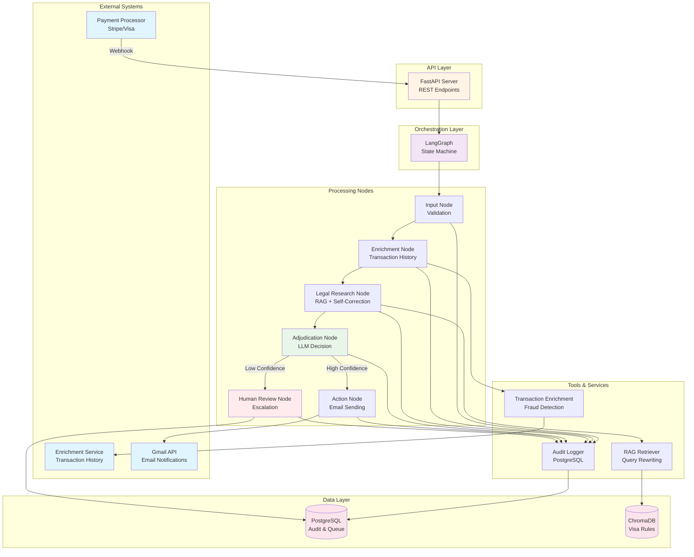

## Workflow State Machine

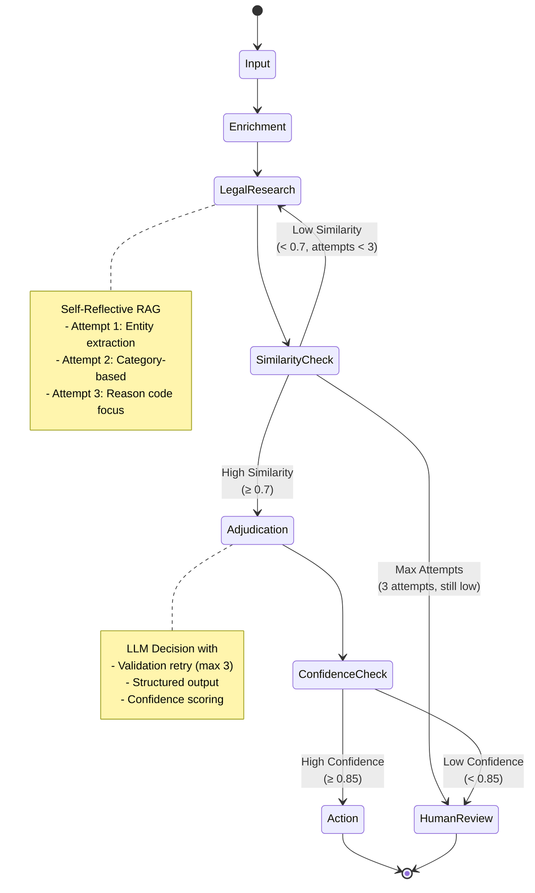

## Component Architecture

### 1. API Layer

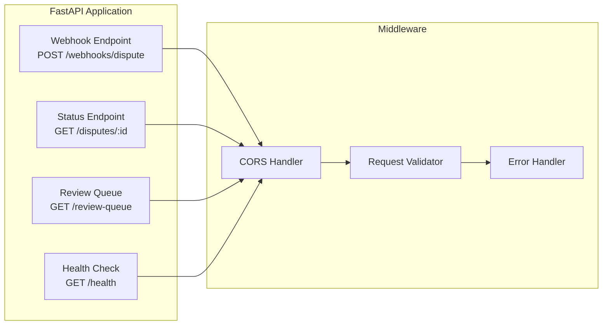

### 2. State Machine

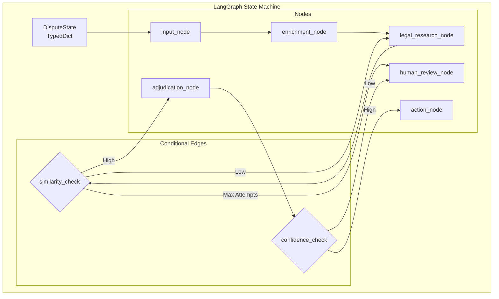

### 3. RAG System

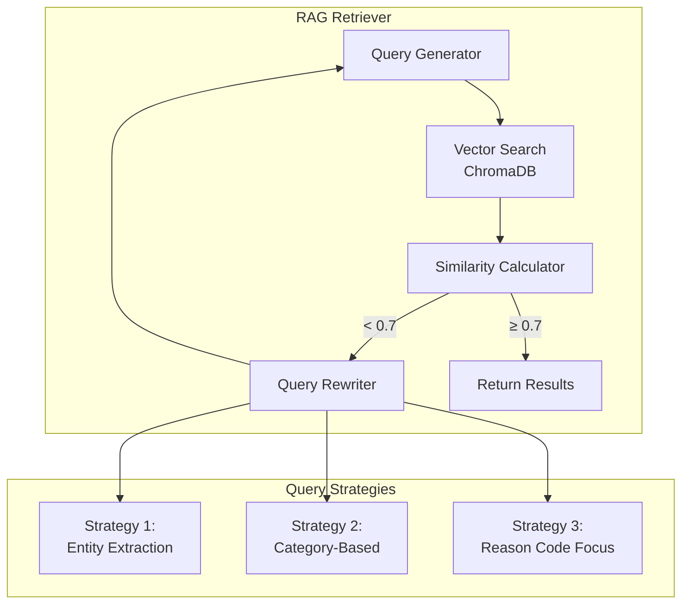

### 4. Database Schema

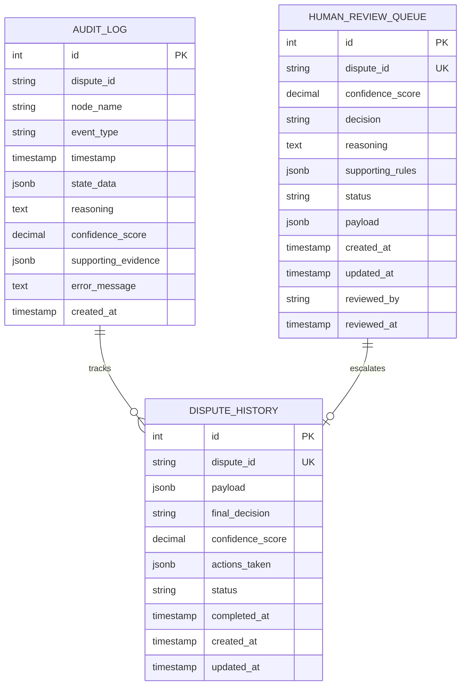

## Data Flow

### Happy Path (High Confidence)

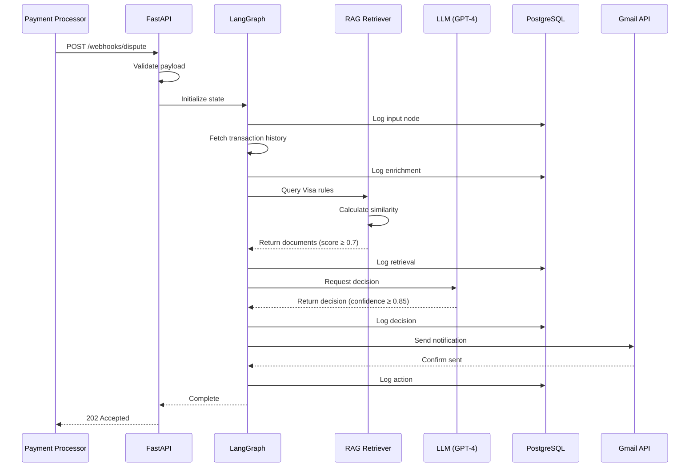

### Self-Correction Path (Low Similarity)

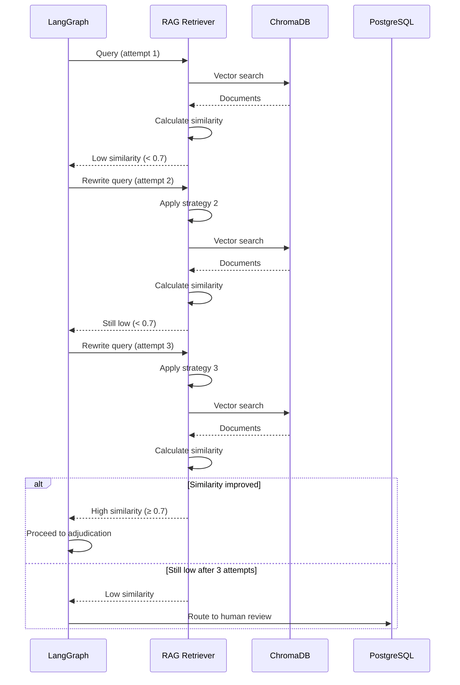

### Escalation Path (Low Confidence)

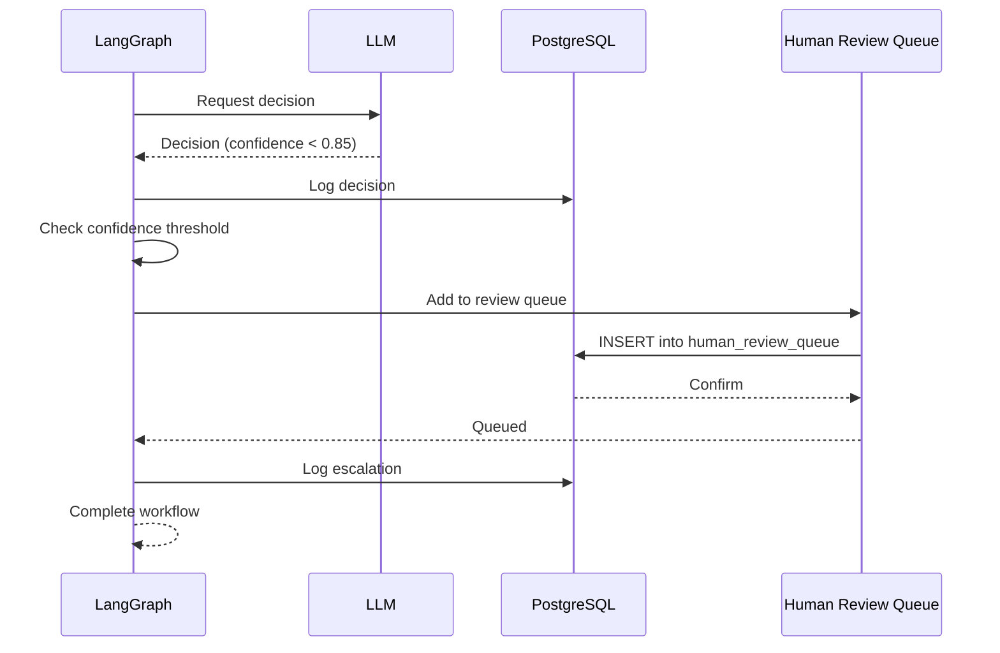

## Deployment Architecture

### Local Development

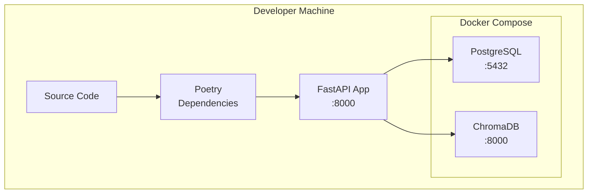

### Production Deployment

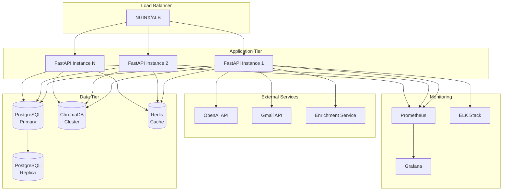

## Security Architecture

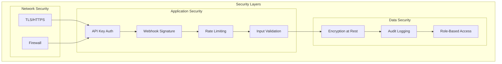

## Scalability Considerations

### Horizontal Scaling
- Stateless API servers
- Shared database and vector store
- Load balancer distribution
- Connection pooling

### Vertical Scaling
- Increase database resources
- Optimize ChromaDB index
- Cache frequently accessed rules
- Batch processing

### Performance Optimization
- Async operations throughout
- Database query optimization
- Vector search tuning
- LLM response caching

## Monitoring & Observability

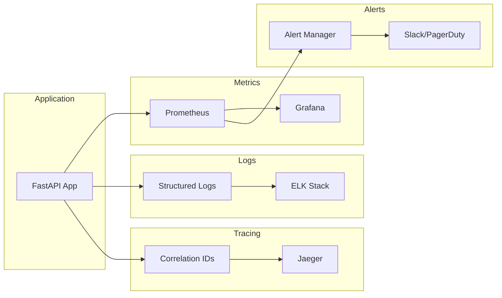

## Technology Stack Summary

| Layer | Technology | Purpose |
|-------|-----------|---------|
| API | FastAPI | REST API server |
| Orchestration | LangGraph | State machine workflow |
| LLM | LangChain + OpenAI | Decision making |
| Validation | Pydantic v2 | Schema validation |
| Database | PostgreSQL + AsyncPG | Audit & queue storage |
| Vector Store | ChromaDB | Visa rules search |
| Testing | Pytest + Hypothesis | Property-based testing |
| Deployment | Docker + Docker Compose | Containerization |
| Migrations | Alembic | Database versioning |

## Design Patterns Used

1. **State Machine Pattern** - LangGraph for workflow management
2. **Repository Pattern** - Database abstraction layer
3. **Strategy Pattern** - Multiple query rewriting strategies
4. **Retry Pattern** - Exponential backoff for failures
5. **Circuit Breaker Pattern** - External service protection (planned)
6. **Observer Pattern** - Audit logging for all events
7. **Factory Pattern** - State initialization
8. **Template Method Pattern** - Node execution flow

## Future Enhancements

1. **Caching Layer** - Redis for frequently accessed data
2. **Message Queue** - RabbitMQ/Kafka for async processing
3. **GraphQL API** - Alternative to REST
4. **WebSocket Support** - Real-time updates
5. **Multi-tenancy** - Support multiple organizations
6. **A/B Testing** - Experiment with different strategies
7. **ML Model Training** - Learn from human reviews
8. **Batch Processing** - Handle multiple disputes efficiently
